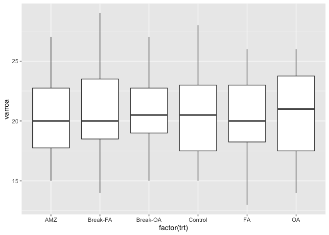
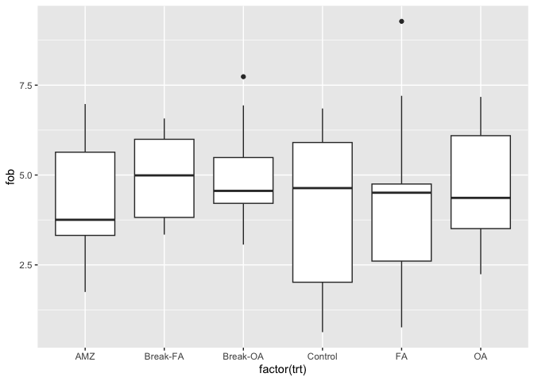

```r
library(tidyverse)
```

```
## ── Attaching packages ─────────────────────────────────────── tidyverse 1.3.2 ──
## ✔ ggplot2 3.4.1     ✔ purrr   1.0.1
## ✔ tibble  3.1.8     ✔ dplyr   1.1.0
## ✔ tidyr   1.3.0     ✔ stringr 1.5.0
## ✔ readr   2.1.4     ✔ forcats 1.0.0
## ── Conflicts ────────────────────────────────────────── tidyverse_conflicts() ──
## ✖ dplyr::filter() masks stats::filter()
## ✖ dplyr::lag()    masks stats::lag()
```


```r
set.seed(10)
fob <- rnorm(60, mean = 5, sd = 2)
set.seed(10)
varroa <- rpois(60, lambda = 20)

datum <- data.frame(fob, varroa)

datum <- datum %>% arrange(desc(varroa))
stratum <- c(rep(1,6),rep(2,6),rep(3,6),rep(4,6),rep(5,6),rep(6,6),rep(7,6),rep(8,6),rep(9,6),rep(10,6))
datum2 <- cbind(datum, stratum)

datum2
```

```
##          fob varroa stratum
## 1  3.4749102     29       1
## 2  1.2925191     28       1
## 3  3.0901123     27       1
## 4  5.3698519     27       1
## 5  3.6502681     26       1
## 6  7.1731028     26       1
## 7  4.9423693     26       2
## 8  7.7359079     25       2
## 9  1.7466546     24       2
## 10 6.5115630     24       2
## 11 4.7964780     24       2
## 12 1.4818265     24       2
## 13 4.3308869     24       3
## 14 6.5726848     24       3
## 15 4.4870432     23       3
## 16 4.5235329     23       3
## 17 0.6294263     23       3
## 18 5.7241745     23       3
## 19 6.6689478     23       4
## 20 5.4650503     23       4
## 21 9.2755342     23       4
## 22 5.1786945     22       4
## 23 3.6968740     22       4
## 24 3.3426749     22       4
## 25 4.3975826     22       5
## 26 5.5890903     21       5
## 27 5.5819750     21       5
## 28 5.0374923     20       5
## 29 6.9748894     20       5
## 30 4.6096992     20       5
## 31 2.4696040     20       6
## 32 3.6248891     20       6
## 33 4.4924389     20       6
## 34 4.8441079     20       6
## 35 6.9371327     20       6
## 36 4.3509120     20       6
## 37 6.3104553     20       7
## 38 3.1955761     20       7
## 39 4.6314949     19       7
## 40 2.5838476     19       7
## 41 3.8073787     19       7
## 42 0.7618776     19       7
## 43 4.2526769     19       8
## 44 7.2035590     18       8
## 45 3.6447708     18       8
## 46 3.8016646     17       8
## 47 4.2726480     17       8
## 48 6.0116385     17       8
## 49 6.8510425     16       9
## 50 5.9659570     16       9
## 51 2.2401128     16       9
## 52 2.1289713     16       9
## 53 4.1987249     16       9
## 54 6.0657940     16       9
## 55 6.4827803     15      10
## 56 3.0646960     15      10
## 57 3.7082115     15      10
## 58 5.7795886     14      10
## 59 3.2556823     14      10
## 60 2.2573389     13      10
```


```r
x = c("Control", "Break-OA", "Break-FA", "FA", "OA", "AMZ")

set.seed(10)
trt <- c(
  sample(x, 6), 
  sample(x, 6), 
  sample(x, 6), 
  sample(x, 6), 
  sample(x, 6),
  sample(x, 6),
  sample(x, 6),
  sample(x, 6),
  sample(x, 6),
  sample(x, 6)
  )

trt
```

```
##  [1] "Break-FA" "Control"  "Break-OA" "AMZ"      "FA"       "OA"      
##  [7] "Break-FA" "Break-OA" "AMZ"      "OA"       "FA"       "Control" 
## [13] "OA"       "Break-FA" "Break-OA" "FA"       "Control"  "AMZ"     
## [19] "OA"       "Control"  "FA"       "Break-OA" "AMZ"      "Break-FA"
## [25] "OA"       "Break-OA" "Control"  "Break-FA" "AMZ"      "FA"      
## [31] "AMZ"      "Control"  "FA"       "OA"       "Break-OA" "Break-FA"
## [37] "Break-FA" "AMZ"      "Break-OA" "OA"       "Control"  "FA"      
## [43] "Break-OA" "FA"       "Break-FA" "AMZ"      "OA"       "Control" 
## [49] "Control"  "AMZ"      "OA"       "FA"       "Break-OA" "Break-FA"
## [55] "Control"  "Break-OA" "AMZ"      "Break-FA" "OA"       "FA"
```


```r
datum3 <- cbind(datum2, trt)

datum3
```

```
##          fob varroa stratum      trt
## 1  3.4749102     29       1 Break-FA
## 2  1.2925191     28       1  Control
## 3  3.0901123     27       1 Break-OA
## 4  5.3698519     27       1      AMZ
## 5  3.6502681     26       1       FA
## 6  7.1731028     26       1       OA
## 7  4.9423693     26       2 Break-FA
## 8  7.7359079     25       2 Break-OA
## 9  1.7466546     24       2      AMZ
## 10 6.5115630     24       2       OA
## 11 4.7964780     24       2       FA
## 12 1.4818265     24       2  Control
## 13 4.3308869     24       3       OA
## 14 6.5726848     24       3 Break-FA
## 15 4.4870432     23       3 Break-OA
## 16 4.5235329     23       3       FA
## 17 0.6294263     23       3  Control
## 18 5.7241745     23       3      AMZ
## 19 6.6689478     23       4       OA
## 20 5.4650503     23       4  Control
## 21 9.2755342     23       4       FA
## 22 5.1786945     22       4 Break-OA
## 23 3.6968740     22       4      AMZ
## 24 3.3426749     22       4 Break-FA
## 25 4.3975826     22       5       OA
## 26 5.5890903     21       5 Break-OA
## 27 5.5819750     21       5  Control
## 28 5.0374923     20       5 Break-FA
## 29 6.9748894     20       5      AMZ
## 30 4.6096992     20       5       FA
## 31 2.4696040     20       6      AMZ
## 32 3.6248891     20       6  Control
## 33 4.4924389     20       6       FA
## 34 4.8441079     20       6       OA
## 35 6.9371327     20       6 Break-OA
## 36 4.3509120     20       6 Break-FA
## 37 6.3104553     20       7 Break-FA
## 38 3.1955761     20       7      AMZ
## 39 4.6314949     19       7 Break-OA
## 40 2.5838476     19       7       OA
## 41 3.8073787     19       7  Control
## 42 0.7618776     19       7       FA
## 43 4.2526769     19       8 Break-OA
## 44 7.2035590     18       8       FA
## 45 3.6447708     18       8 Break-FA
## 46 3.8016646     17       8      AMZ
## 47 4.2726480     17       8       OA
## 48 6.0116385     17       8  Control
## 49 6.8510425     16       9  Control
## 50 5.9659570     16       9      AMZ
## 51 2.2401128     16       9       OA
## 52 2.1289713     16       9       FA
## 53 4.1987249     16       9 Break-OA
## 54 6.0657940     16       9 Break-FA
## 55 6.4827803     15      10  Control
## 56 3.0646960     15      10 Break-OA
## 57 3.7082115     15      10      AMZ
## 58 5.7795886     14      10 Break-FA
## 59 3.2556823     14      10       OA
## 60 2.2573389     13      10       FA
```


```r
datum3 %>% 
  ggplot(aes(x=factor(trt), y=varroa)) +
  geom_boxplot()
```

<!-- -->

```r
datum3 %>% 
  ggplot(aes(x=factor(trt), y=fob)) +
  geom_boxplot()
```

<!-- -->


